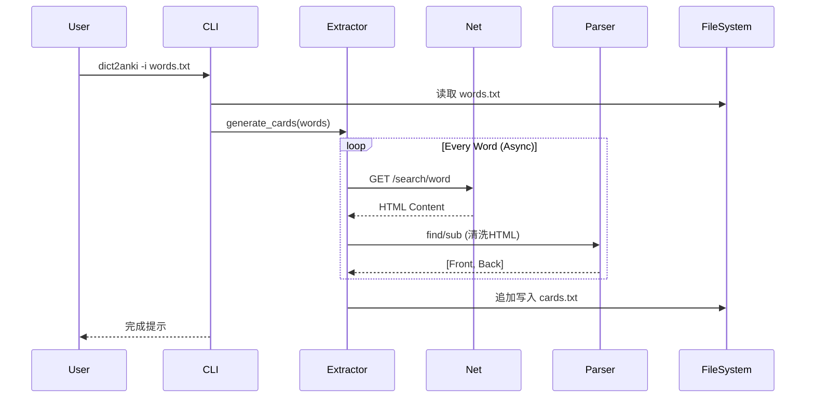

# 项目总览 (Overview)

`dict2anki` 是一个基于 Python 的命令行工具，旨在将单词列表批量转换为可导入 Anki 的卡片。它采用零外部依赖的设计，内置了定制的 HTTP 客户端和 HTML 解析器。

## 核心概念 (Core Concepts)

我们将系统分解为以下四个隐喻概念：

### 1. 点火钥匙 (Ignition Key)
*   **入口点**: `__main__.py` 和 `cli.py`。
*   **功能**: 负责解析命令行参数，初始化配置，选择并启动相应的“引擎”，最后处理输出结果。
*   **代码对应**: `dict2anki/cli.py` 中的 `main()` 函数。

### 2. 引擎 (Engine)
*   **核心组件**: `CardExtractor` 及其子类（如 `CambridgeExtractor`）。
*   **功能**: 负责执行具体的单词查询、页面下载、数据提取和格式化工作。它是系统动力的来源。
*   **代码对应**: `dict2anki/extractors/` 目录下的类。

### 3. 名词 (Nouns - Data Structures)
*   **Words (输入)**: 简单的字符串列表，代表待查询的单词。
*   **Fields (中间态)**: 提取出的正面（Front）和背面（Back）HTML 内容。
*   **Card (输出)**: 最终生成的 Anki 卡片数据（通常是一行 CSV 格式的文本）。
*   **Template (模具)**: 定义卡片样式的 CSS 和 HTML 模板 (`front-template`, `back-template`, `styling`)。

### 4. 动词 (Verbs - Actions)
*   **Extract (提取)**: 从 HTML 源码中定位并清洗定义、例句等信息。
*   **Generate (生成)**: 编排整个流程，包括模板生成、并发查询、结果写入。
*   **Retrieve (获取)**: 通过网络下载网页或静态资源（CSS/Fonts）。

## 系统架构 (Architecture)

### 模块依赖图 (Module Dependency Graph)

```mermaid
graph TD
    User[用户] --> CLI[cli.py]
    CLI --> |初始化| Extractor[CardExtractor]
    CLI --> |读取| Input[words.txt]
    
    subgraph Extractors
        Extractor <|-- Cambridge[CambridgeExtractor]
        Extractor --> |使用| Utils[utils.py]
    end
    
    subgraph Network & Parsing
        Cambridge --> |下载| Net[net.py]
        Cambridge --> |解析| HTML[htmls.py]
    end
    
    subgraph Output
        Extractor --> |写入| Cards[cards.txt]
        Extractor --> |写入| Templates[Templates & Media]
    end
```

### 数据流向图 (Data Flow)



## 目录结构映射

| 路径 | 角色 | 描述 |
| :--- | :--- | :--- |
| `dict2anki/cli.py` | Controller | 命令行交互与流程控制 |
| `dict2anki/extractors/extractor.py` | Interface | 定义提取器的基类与通用逻辑（如并发控制） |
| `dict2anki/extractors/cambridge.py` | Implementation | 剑桥词典的具体实现逻辑 |
| `dict2anki/net.py` | Network | 封装 urllib，处理重试、编码、压缩 |
| `dict2anki/htmls.py` | Parser | 自研的正则/索引定位 HTML 解析器 |
| `dict2anki/utils.py` | Util | 日志 (Log)、路径处理、进度条 |

## 关键流程

1.  **启动**: 用户运行命令，`cli.py` 解析参数。
2.  **准备**: 实例化指定的 Extractor (默认 Cambridge)，生成 Anki 模板文件。
3.  **循环**:
    *   Extractor 使用 `asyncio` 并发处理单词列表。
    *   对每个单词调用 `get_card`。
    *   `get_card` 调用 `net.py` 下载页面。
    *   `get_card` 调用 `_extract_fields`，利用 `htmls.py` 清洗数据。
4.  **输出**: 成功的结果写入 `cards.txt`，失败的记录日志。
