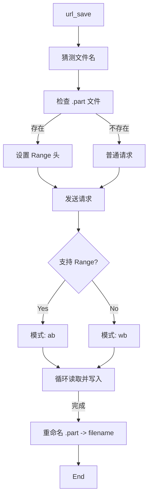

# 模块分析: 网络层 (net.py)

本模块封装了 Python 标准库 `urllib`，提供了一个健壮的 HTTP 客户端，专门处理爬虫常见的痛点。

## 文件信息
*   **路径**: `dict2anki/net.py`
*   **主要职责**: HTTP 请求发送、重试机制、Gzip 解压、字符集解码、断点续传下载。

## 关键函数

### 1. `fake_headers()`
返回一个字典，伪装成常见的浏览器 (Chrome on MacOS)，包含 `User-Agent`, `Accept`, `Accept-Language` 等，以规避简单的反爬虫策略。

### 2. `urlopen_with_retry(...)`
封装了 `urllib.request.urlopen`。
*   **重试机制**: 接受 `retry` 参数（默认 5 次）。
*   **错误处理**: 捕获异常并记录 Warning 日志，直到重试次数耗尽才抛出异常。

### 3. `url_get_content(...)`
获取并解析网页文本内容。
*   **解压**: 自动检测 `Content-Encoding` 头部，支持 `gzip` 和 `deflate` 解压。
*   **解码**:
    1.  优先检查 `Content-Type` 头部的 `charset`。
    2.  如果未找到，默认使用 `utf-8` 并忽略错误 (`ignore`)。
    3.  返回字符串。

### 4. `url_save(...)`
实现了带有**断点续传**功能的文件下载器。
*   **文件命名**:
    *   首先尝试从 `Content-Disposition` 头获取文件名。
    *   其次尝试从 URL 路径获取。
    *   最后根据 `Content-Type` 猜测扩展名。
*   **断点续传逻辑**:
    1.  检查是否存在 `.part` 临时文件。
    2.  如果存在，读取其大小，并在请求头中设置 `Range: bytes={size}-`。
    3.  验证服务器返回的 `Content-Range` 或 `Content-Length` 以确认是否支持续传。
    4.  以追加模式 (`ab`) 或 写入模式 (`wb`) 打开文件。
    5.  分块读取 (`512 * 1024` bytes) 并写入，直到完成。
*   **完成处理**: 下载完成后将 `.part` 文件重命名为目标文件名。

## 流程图 (url_save)

## 评价
这是一个功能相当完善的“微型 requests 库”。手动处理 gzip 和断点续传显示了作者对底层 HTTP 的理解，但也增加了维护成本。在重写时，若允许引入依赖，直接使用 `requests` 或 `httpx` 可以删除此文件 90% 的代码。
